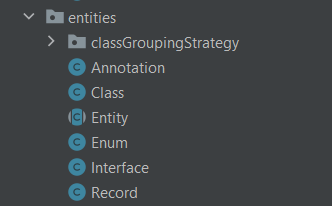
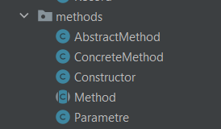
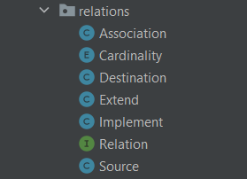
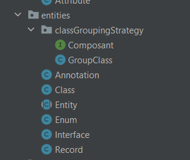
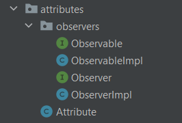
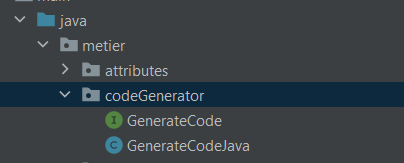
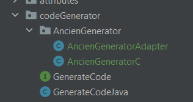

## metier.entities

## attributs

## metier.methods

## metier.relations

## grouping desgin pattern

## observer desgin pattern

## strategy desgin pattern generate code

## adapter desgin pattern generate code

